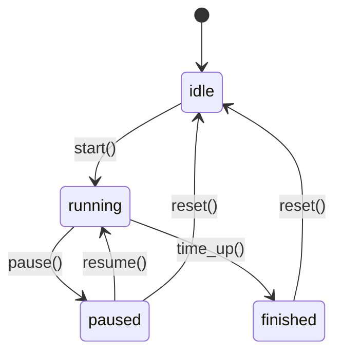

# 設計書

## 概要

スピーチタイマーは、React + TypeScript + Viteをベースとしたモバイル優先のWebアプリケーションです。高精度な時間計測、直感的なUI/UX、アクセシビリティ対応を重視し、発表者が時間を意識しながら集中して発表できる環境を提供します。

## アーキテクチャ

### システムアーキテクチャ

```mermaid
graph TB
    UI[UIレイヤー] --> State[状態管理]
    State --> Timer[タイマーエンジン]
    State --> Audio[オーディオシステム]
    State --> Storage[ストレージレイヤー]
    
    Timer --> RAF[RequestAnimationFrame]
    Timer --> Performance[Performance.now()]
    
    Audio --> WebAudio[Web Audio API]
    Audio --> Gain[GainNode]
    
    Storage --> LocalStorage[localStorage]
```

### 技術スタック

- **フロントエンドフレームワーク**: React 18 + TypeScript
- **ビルドツール**: Vite
- **スタイリング**: Tailwind CSS
- **状態管理**: Zustand（軽量、TypeScript対応）
- **ルーティング**: React Router DOM（最小限の使用）
- **テスト**: Vitest + React Testing Library + Playwright
- **時間管理**: ネイティブPerformance API + RequestAnimationFrame
- **オーディオ**: Web Audio API with OscillatorNode
- **ストレージ**: 設定永続化用localStorage

## コンポーネントとインターフェース

### コアデータモデル

```typescript
export type Millis = number;
export type ProgressMode = 'remaining' | 'elapsed';

export interface TimerSettings {
  theme: 'mint' | 'system';
  bellEnabled: { first: boolean; second: boolean; third: boolean };
  bellTimesMs: { first: Millis; second: Millis; third: Millis };
  progressMode: ProgressMode;
  volume: number; // 0..1
}

export interface TimerState {
  status: 'idle' | 'running' | 'paused' | 'finished';
  durationMs: Millis;
  startEpochMs?: number;
  pauseAccumulatedMs: Millis;
  nowEpochMs: number;
}

export interface BellState {
  triggered: { first: boolean; second: boolean; third: boolean };
  lastCheckMs: Millis;
}
```

### コンポーネント階層

```
App
├── AppShell
│   ├── Header（設定アイコン）
│   ├── MainContent
│   │   └── Router
│   │       ├── MainTimer
│   │       │   ├── TimeDisplay
│   │       │   ├── CircularProgress
│   │       │   ├── Controls
│   │       │   ├── BellScheduleStrip
│   │       │   └── StartAndNowClock
│   │       └── Settings
│   │           ├── BackButton
│   │           ├── ThemePicker
│   │           ├── BellSoundPicker
│   │           └── ProgressModeToggle
│   └── Footer
└── AudioManager（コンテキストプロバイダー）
```

### 状態管理アーキテクチャ

```typescript
// Zustandストア構造
interface AppStore {
  // タイマー状態
  timer: TimerState;
  settings: TimerSettings;
  bells: BellState;
  
  // アクション
  startTimer: () => void;
  pauseTimer: () => void;
  resetTimer: () => void;
  setDuration: (ms: Millis) => void;
  updateNow: (ms: Millis) => void;
  
  // 設定アクション
  updateSettings: (partial: Partial<TimerSettings>) => void;
  
  // ベルアクション
  triggerBell: (type: 'first' | 'second' | 'third') => void;
  resetBells: () => void;
}
```

## データモデル

### タイマーエンジン設計

**時間計算戦略:**
- 高精度タイムスタンプに`performance.now()`を使用
- 経過時間の計算: `elapsed = (now - startTime) - pauseAccumulated`
- 残り時間の計算: `remaining = duration - elapsed`
- 更新頻度: `requestAnimationFrame`による60fps
- 表示更新: パフォーマンスのため250msにスロットル

**状態遷移:**


### ベルスケジューリングシステム

**ベルトリガーロジック:**
```typescript
interface BellTrigger {
  checkBells(currentRemainingMs: Millis, previousRemainingMs: Millis): void;
  // トリガー条件: previousRemaining > threshold && currentRemaining <= threshold
}
```

**重複防止:**
- 各ベルのトリガー状態を追跡
- タイマーリセット時にトリガーフラグをリセット
- 同じしきい値での複数トリガーを防止

### オーディオシステム設計

**Web Audio API実装:**
```typescript
interface AudioManager {
  context: AudioContext;
  gainNode: GainNode;
  
  playBell(): Promise<void>;
  setVolume(level: number): void;
  testSound(): Promise<void>;
}
```

**音声生成:**
- エンベロープ付き1kHz正弦波（アタック: 50ms、ディケイ: 200ms）
- GainNodeによる音量制御
- 正確なタイミングのための低遅延再生

## エラーハンドリング

### タイマー精度エラーハンドリング
- **ドリフト補正**: 絶対タイムスタンプに基づく再計算
- **パフォーマンス監視**: タイミング精度の追跡とログ記録
- **フォールバック戦略**: RAFが失敗した場合はsetIntervalを使用

### オーディオエラーハンドリング
- **コンテキスト停止**: 自動再生ポリシーの処理
- **フォールバックオーディオ**: 代替音声生成の提供
- **ユーザーインタラクション**: オーディオ初期化にユーザージェスチャーが必要

### ストレージエラーハンドリング
- **localStorage利用不可**: メモリのみへの適切な劣化
- **容量超過**: 古いデータをクリアして再試行
- **解析エラー**: デフォルト設定にリセット

### ネットワーク/オフライン処理
- **オフライン優先**: すべての機能がネットワークなしで動作
- **リソース読み込み**: フォント/アセット読み込み失敗の処理
- **サービスワーカー**: 将来のPWA実装に対応

## テスト戦略

### 単体テスト（Vitest）
```typescript
// タイマーエンジンテスト
describe('TimerEngine', () => {
  test('残り時間を正確に計算する');
  test('一時停止/再開を正しく処理する');
  test('長時間にわたって精度を維持する');
});

// ベルシステムテスト
describe('BellSystem', () => {
  test('正しいしきい値でベルをトリガーする');
  test('重複ベルトリガーを防ぐ');
  test('タイマーリセット時にベル状態をリセットする');
});

// 設定永続化テスト
describe('SettingsManager', () => {
  test('設定をlocalStorageに保存する');
  test('アプリ開始時に設定を読み込む');
  test('破損した設定データを処理する');
});
```

### コンポーネントテスト（React Testing Library）
```typescript
// UIコンポーネントテスト
describe('TimeDisplay', () => {
  test('時間をmm:ss形式で表示する');
  test('クリック時に編集モードに入る');
  test('時間入力を検証する');
});

describe('CircularProgress', () => {
  test('正しい進捗パーセンテージを表示する');
  test('残り時間/経過時間モードを切り替える');
  test('タイマー実行中にスムーズに更新する');
});
```

### エンドツーエンドテスト（Playwright）
```typescript
// E2Eテストシナリオ
test('完全なタイマーワークフロー', async ({ page }) => {
  // 10分タイマーを設定
  // タイマーを開始
  // 2分待機（加速）
  // タイマーを一時停止
  // タイマーを再開
  // ベルトリガーを検証
  // 完了を検証
});

test('設定の永続化', async ({ page }) => {
  // 設定を変更
  // ページを再読み込み
  // 設定が保持されていることを検証
});
```

### パフォーマンステスト
- **フレームレート監視**: タイマー動作中の60fps確保
- **メモリ使用量**: 長時間セッション中のメモリリーク監視
- **タイミング精度**: 長期間にわたる±50ms精度の検証

### アクセシビリティテスト
- **キーボードナビゲーション**: すべての機能がキーボードでアクセス可能
- **スクリーンリーダー**: ARIAラベルとセマンティックHTML
- **カラーコントラスト**: WCAG AA準拠
- **フォーカス管理**: 明確なフォーカスインジケーター

## 実装フェーズ

### フェーズ1: コアインフラストラクチャ
- プロジェクトセットアップ（Vite + React + TypeScript + Tailwind）
- 基本ルーティングとレイアウト構造
- 状態管理セットアップ（Zustand）
- テーマシステム実装

### フェーズ2: タイマーエンジン
- 高精度タイマー実装
- 状態管理統合
- 基本時間表示とコントロール
- タイマーロジックの単体テスト

### フェーズ3: ユーザーインターフェース
- 編集機能付きTimeDisplayコンポーネント
- CircularProgressコンポーネント
- コントロールボタン（再生/一時停止/リセット）
- モバイルレスポンシブレイアウト

### フェーズ4: ベルシステム
- ベルスケジューリングロジック
- オーディオシステム実装
- ベル設定UI
- 音声テスト機能

### フェーズ5: 設定と永続化
- 設定画面実装
- localStorage統合
- テーマ切り替え
- 設定検証

### フェーズ6: 仕上げとアクセシビリティ
- キーボードショートカット
- ARIAラベルとセマンティックHTML
- フォーカス管理
- パフォーマンス最適化

### フェーズ7: テストと品質保証
- 包括的テストスイート
- E2Eテストシナリオ
- パフォーマンスベンチマーク
- アクセシビリティ監査

## セキュリティ考慮事項

### データプライバシー
- **ローカルストレージのみ**: 外部データ送信なし
- **個人データなし**: アプリ設定のみ保存
- **データクリアオプション**: ユーザーがすべての設定をリセット可能

### コンテンツセキュリティポリシー
- **厳格なCSP**: XSS攻撃の防止
- **オーディオコンテキスト**: 安全なオーディオAPI使用
- **リソース読み込み**: すべての外部リソースの検証

## パフォーマンス考慮事項

### レンダリング最適化
- **React.memo**: 不要な再レンダリングの防止
- **useMemo/useCallback**: 高コスト計算の最適化
- **コンポーネント分割**: 設定画面の遅延読み込み

### タイマーパフォーマンス
- **RequestAnimationFrame**: スムーズな60fps更新
- **スロットル更新**: 250ms間隔での表示更新
- **効率的な計算**: レンダーループでの計算最小化

### メモリ管理
- **イベントクリーンアップ**: アンマウント時のリスナー削除
- **オーディオコンテキスト**: オーディオリソースの適切なクリーンアップ
- **状態正規化**: 効率的な状態構造

## デプロイ戦略

### ビルド設定
- **Vite最適化**: ツリーシェイキングとコード分割
- **アセット最適化**: 画像とフォントの最適化
- **バンドル分析**: バンドルサイズの監視

### プログレッシブWebアプリ（将来）
- **サービスワーカー**: オフライン機能
- **アプリマニフェスト**: インストールプロンプト
- **キャッシュ戦略**: 静的アセットのキャッシュファースト

### ブラウザ互換性
- **モダンブラウザ**: Chrome 90+、Firefox 88+、Safari 14+
- **ポリフィル**: Web Audio APIの最小限のポリフィル
- **適切な劣化**: サポートされていない機能のフォールバック

## タイマーアプリ デザインガイド

出典: [ドキュメント1（sheet1）](https://www.figma.com/design/t1xyTOy4za51SGL89ohgOE/timer-design?node-id=100-1191&m=dev), [ドキュメント2（sheet2）](https://www.figma.com/design/t1xyTOy4za51SGL89ohgOE/timer-design?node-id=108-1256&m=dev)

---

### 1. アプリ概要
- **ターゲット**: 研究発表や講評時に、発表時間を測る人
- **目的**: 発表時間を正確に計測し、視覚と聴覚で残り時間を分かりやすく通知することで、円滑な発表をサポート
- **コンセプト**: 「集中を妨げない、シンプルな時間管理」。操作を容易にし、シンプルなUI/UXと必要十分な機能を提供

### 2. 全体デザインガイドライン
- **ブランドカラー**
  - メイン: 落ち着いたミントグリーン（進捗バー、時刻表示、ボタン類）
  - アクセント: 鮮やかなイエロー（ベルアイコン）
  - 背景: ホワイト
  - ねらい: フォーマルな場に適合し、視認性と集中を両立。目に優しく長時間でも疲れにくい
- **タイポグラフィ**
  - サンセリフ体（例: Noto Sans）
  - ねらい: 数字の視認性と即読性を最優先

### 3. メイン画面（構成と意図）
- **a. 設定アイコン（右上）**
  - 要素: 歯車アイコン
  - 役割: 各種設定（ベル音、プログレスバー表示など）への入口。タイマー機能を邪魔しない右上配置
- **b. メインタイマー表示（中央上部）**
  - 要素: 大きな残り時間表示（クリックで時間設定）、円形プログレスバー
  - 意図:
    - 数字を大きくし、一目で残り時間を把握
    - プログレスバーで時間の経過・残量を直感可視化
    - 表示はデフォルトで残り時間。設定で経過時間表示に切替可能
- **c. 操作ボタン（中央下部）**
  - 要素: リセット（左）／ベル（中央）／再生・一時停止（右）
  - 意図:
    - 押しやすい十分なサイズ
    - 直感的でユニバーサルなアイコン（Google Icon）。重要操作を色で強調（ベル=黄色）
    - 配置の意味付け: 左=戻る（リセット）、右=進む（再生/一時停止）
- **d. ベル時間設定（下部）**
  - 要素: 1令・2令・3令の時刻表示/設定（タップで編集）、ベル設定のオン/オフ
  - 意図: 一覧性・視認性・操作性を確保し、メイン画面から直接設定可能
- **e. 開始/現在時刻表示（最下部）**
  - 要素: タイマー開始時刻、現在のリアルタイム時刻
  - 意図: 発表の開始時刻や全体の進行状況の把握を補助

### 4. 設定画面（構成と意図）
- **a. 戻るボタン（左上）**
  - 要素: 矢印アイコン
  - 意図: メイン画面へ戻る明確な導線。感覚的な「戻る」に合わせ左配置
- **b. 各種設定**
  - 要素: テーマカラー設定、ベル音設定、プログレスバー表示（残り/経過）
  - 意図:
    - ユーザーの好みや環境に合わせたパーソナライズ
    - 視覚的ニーズへの対応（プログレスバーを残り/経過のどちらで示すか選択）

---

### 5. 実装の原則（開発前チェック）
- **視認性**: 大きな数字、十分なコントラスト、押しやすいボタンサイズ
- **聴覚通知**: 1/2/3令の鳴動タイミングを設定・ON/OFFできること
- **同期**: 円形プログレスと残り/経過表示の状態を常に一致
- **配置規則**: 左=戻る/リセット、右=進む のメンタルモデルを踏襲
- **アクセシビリティ**: 色みだけに依存しない情報提示、フォーカス/キーボード操作の考慮

---

### 6. 参考（フォント/サイズ変数 from Figma）
- Title2/Regular: size 22, lineHeight 28
- Subheadline/Regular: size 15, lineHeight 20
- Caption1/Regular: size 12, lineHeight 16

---

このドキュメントは上記Figmaを唯一のソースとして統合しています。各実装タスク開始前に本ドキュメントとFigma該当ノードを必ず参照してください。 